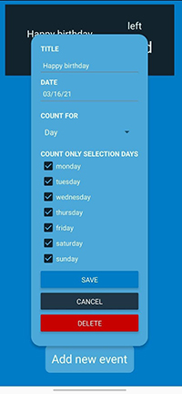

## Count Day for Android.

- TypeScript, 
- React-native. 
- State management use native React hooks useContenxt and useReducer instead Redux or like.
<table>
  <tr><td colspan=2><strong>Android</strong></td></tr>
  <tr>
    <td>

</td>
  </tr>
</table>
